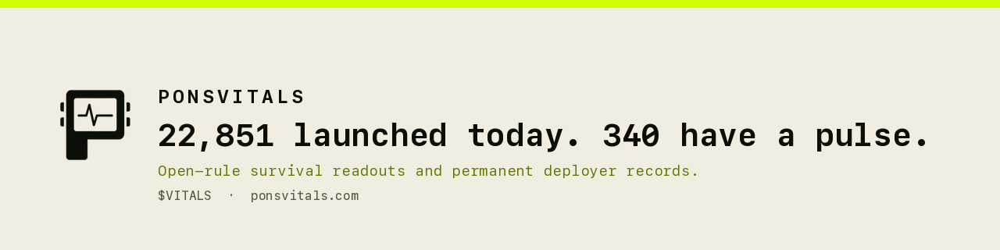

<div align="center">



<br><br>

**Open-rule survival data for every token on the launchpad.**
<br>
No wallet. No signup. No paid placement.

<br>

[](https://robinhoodchain.blockscout.com)
[](https://nextjs.org)
[](https://react.dev)
[](https://www.typescriptlang.org)
[](#security-posture)
[](#what-ponsvitals-is-not)

<br>

[**Website**](https://ponsvitals.com) ·
[**Live board**](https://app.ponsvitals.com) ·
[**Docs**](https://ponsvitals.com/docs) ·
[**X**](https://x.com/ponsvitals) ·
[**Telegram**](https://t.me/ponsvitals)

</div>

---

## 22,851 launched today. 340 have a pulse.

The launchpad won the supply side and never built the demand side. Sixteen tokens deploy every minute, around the clock, and the overwhelming majority of them never receive a single buy from a single wallet.

Nobody was publishing that number. PonsVitals publishes it — hourly, free, and under a rule you can recompute yourself from public chain data.

We do not predict which token goes up. We report which one is still breathing, and we show our work.

---

## The problem, measured

Taken directly from chain reads on the V2 factory. Every figure below is reproducible from the formulas in [`app/lib/chain.ts`](app/lib/chain.ts).

| Metric | Value | How it was measured |
|---|---:|---|
| Launches per day | **22,851** | `TokenLaunched` event count extrapolated over a 200k-block window |
| Flatlined at 12h (zero reserve) | **82.0%** | curve ETH balance across 300 launches aged ~12h |
| Below 0.01 ETH | **97.3%** | same sample |
| At or above 0.1 ETH | 0.3% | same sample |
| Graduated to a full pool | **1.5%** | `getLaunchedToken().phase` |
| Fee recipient ≠ deployer | **23%** | basis of the cluster graph |
| From wallets with ≥5 launches in-window | 22.6% | unique deployers over launch count |

> Not "low liquidity". **Zero.** 82% of launches never receive one buy, and the venue's own analytics surface currently reports no history at all.

---

## Architecture

Three layers. The first is invisible and does the work, the second is what people see and share, the third is where the protocol earns. None of them functions without the one below it.

```
LAYER 1 — THE RECORD              (silent, always running)
Every launch event, every deployer, forever. Accumulated
forward only. This is the asset.
        │  feeds scores into
        ▼
LAYER 2 — THE BOARD               (public, free, shareable)
22,851 in → ~340 out, on a published deterministic gate
anyone can recompute. The front door.
        │  supplies audience + underwriting data to
        ▼
LAYER 3 — REVIVAL                 (opt-in, on-chain, priced)
Synchronized entry into a flatlined curve, in one block.
        └──── every revival writes back into LAYER 1
```

### The gate

The rule is published, versioned, and deterministic:

```
reserve ≥ threshold  AND  distinct clean buyers ≥ 3
```

| State | Share | Condition |
|---|---:|---|
| `FLATLINE` | 82.0% | zero reserve — archived to the graveyard |
| `WEAK` | 15.3% | under 0.01 ETH |
| `PULSE` | 2.4% | ≥ 0.01 ETH with clean buyers |
| `HEATING` | 0.3% | ≥ 0.1 ETH |
| `GRADUATED` | 1.5% | full pool reached |
| `FLAGGED` | varies | self-funded or adverse cluster — shown, labelled, sorted last |

Flagged tokens are never hidden. Hiding them would make the count a lie.

> [!NOTE]
> **Current rule version in this repo is `v0`.** The shipped app rates on reserve alone — see [`rate()`](app/lib/chain.ts). The clean-buyer discount and cluster modifiers require the standing indexer (Phase 0) and are not in this tree yet. The UI states this plainly rather than implying a rating it cannot yet compute.

### Clustering

23% of launches route the creator fee recipient to a wallet that is **not** the deployer — an operator separating the wallet that acts from the wallet that collects.

An operator will burn fifty deployer wallets a day; wallets cost nothing. What they will not do is scatter the money, because the entire point of running fifty wallets is that proceeds arrive in one place.

```
deployer A ─┐
deployer B ─┼──► same fee recipient ──► ONE OPERATOR
deployer C ─┘
```

So the graph keys on the **collection point**, not the action point. A fresh deployer address inherits the record of the cluster it pays into.

---

## Repository layout

```
.
├── app/                  the live board — app.ponsvitals.com
│   ├── app/
│   │   ├── api/          read-only JSON endpoints (board, token, wallet)
│   │   ├── token/        token readout, deployer record above the chart
│   │   ├── wallet/       windowed deployer record + fee-recipient surface
│   │   ├── graveyard/    flatlined launches
│   │   └── revival/      Phase 3 preview
│   ├── components/       BoardView, WalletView, Shell, Reveal
│   ├── content/          copy + canonical links (single source of truth)
│   └── lib/chain.ts      zero-dependency JSON-RPC reader + rating function
│
├── web/                  landing page + /docs — ponsvitals.com
│   ├── app/
│   ├── components/
│   └── content/          copy, docs content, links
│
└── brand/                logo, mark, mono and inverse lockups
```

Both surfaces are independent Next.js apps with their own lockfile and `Dockerfile`.

---

## Quick start

Requires **Node 22+** and **pnpm 10**.

```bash
git clone https://github.com/ponsvitals/ponsvitals.git
cd ponsvitals

# the live board
cd app && pnpm install && pnpm dev      # → http://localhost:3000

# the landing page
cd ../web && pnpm install && pnpm dev   # → http://localhost:3000
```

Nothing else is required. There is no database to provision, no API key to obtain and no account to create — the app reads a public JSON-RPC endpoint directly.

### Build

```bash
pnpm build && pnpm start
```

---

## Configuration

| Variable | Required | Purpose |
|---|---|---|
| `NEXT_PUBLIC_TOKEN_CA` | no | Token contract address. When empty, every trading surface stays hidden instead of rendering a dead link. |

That is the complete list.

> [!WARNING]
> **`NEXT_PUBLIC_*` values are compiled into the browser bundle and are readable by anyone.** Never place a secret behind that prefix. This project has no server-side secret by design — if a future component needs one, it belongs in a server-only variable and must never be committed.

Set it in `.env.local` when you need the address locally. Every `.env*` file is git-ignored.

---

## Docker

Each app ships a multi-stage build producing a Next.js standalone output that runs as a non-root user.

```bash
cd app
docker build -t ponsvitals-app .
docker run --rm -p 3000:3000 ponsvitals-app
```

Verify the container is not running as root before exposing it:

```bash
docker run --rm ponsvitals-app id     # expected: uid=1001, never uid=0
```

---

## HTTP API

All endpoints are read-only `GET`, unauthenticated, and served from live chain reads with a short server-side cache.

| Endpoint | Returns |
|---|---|
| `GET /api/board` | Board snapshot — latest block, scan window, state counts, rated launches |
| `GET /api/token/{address}` | Token readout — curve, deployer, fee recipient, creator tax, buyback flag, phase, graduation threshold, reserve, state |
| `GET /api/wallet/{address}` | Windowed deployer record — launches, state counts, distinct fee recipients |

Addresses are validated against `^0x[0-9a-fA-F]{40}$` before any chain call. Malformed input returns `400`, unknown tokens `404`, degraded chain access `503`.

```bash
curl -s https://app.ponsvitals.com/api/board | jq '.counts'
```

### Stale data is labelled as stale

When chain access degrades, the reader returns the previous snapshot marked `stale: true` alongside the last successful read time. An old number is never presented as a current one — a dead feed that looks alive is worse than no feed.

---

## Methodology and reproducibility

`app/lib/chain.ts` is a dependency-free JSON-RPC client. Every selector and topic hash is precomputed and annotated with the source string it was derived from, so a reader can verify each one independently:

| Constant | Source string |
|---|---|
| `TOPIC_LAUNCHED` | `keccak256("TokenLaunched(address,address,address,address,uint256,uint256)")` |
| `SEL_GET_LAUNCHED` | `getLaunchedToken(address)` |
| `SEL_NAME` / `SEL_SYMBOL` | `name()` / `symbol()` |

`getLaunchedToken` returns a fifteen-word static tuple which is decoded by hand rather than through an ABI dependency. The layout is documented inline at the decode site.

If your recomputation disagrees with a published rating, that is a bug worth an issue. Rule changes are announced before they take effect and prior ratings keep their version stamp.

---

## Security posture

This is a public-data product and the threat model is treated accordingly.

- **No wallet connect anywhere.** The free tier requires no wallet, no signup and no email. There is no connect button in the tree, so there is no signing surface to abuse.
- **Zero server-side secrets.** The app talks to a public JSON-RPC endpoint. No database credential, no API key and no private key exists in this repository or is needed to run it.
- **Read-only surface.** Every route handler is a `GET`. There are no mutation endpoints, no admin routes and no privileged operations exposed by the web tier.
- **Input validation before egress.** Address parameters are regex-validated before any outbound chain call.
- **Non-root containers.** Both images create an unprivileged user and drop to it via `USER` in the Dockerfile — fixed at image level, not patched into a running container.
- **No sensitive data collected.** Nothing about a visitor is stored, because nothing about a visitor is requested.

### Reporting a vulnerability

Please do not open a public issue for a security report. Send it to the maintainers via [Telegram](https://t.me/ponsvitals) or the contact listed on [ponsvitals.com](https://ponsvitals.com), and allow a reasonable window before public disclosure. See [`SECURITY.md`](SECURITY.md).

---

## Roadmap

| Phase | Scope | State |
|---|---|---|
| **0 — The Indexer** | Launch listener on both factory generations, enrichment worker, pulse loop, cluster builder. Zero user interface. | In progress |
| **1 — The Board** | Rating engine published at `/rule`, public board defaulting to survived, deployer record above the chart, hourly cull counter. | Shipped |
| **2 — The Record in public** | Wallet lookup with no connect, cluster graph explorer, graveyard filters, alert bot, record cards. | Partial |
| **3 — Revival** | Escrow contract with external review, testnet then capped live windows, receipt cards, public fee and buyback ledger. | Planned |
| **4 — $VITALS** | Fair launch, creator tax 0 bps, buyback flag enabled, holder tiers activate and the free tier does not shrink. | Planned |
| **5 — Machine layer** | Holder-gated read API and stream, second launchpad on the same schema, historical export. | Planned |

Phase 0 is urgent in a way the others are not: the record accrues forward only, and every day without an indexer is history that cannot be reconstructed later at any cost.

---

## What PonsVitals is not

- **Not a launchpad.** Every token still launches where it already launches. There is no competing launch button anywhere in this product.
- **Not a price predictor.** No targets, no calls, no "potential". Survival is an observation about the past.
- **Not a paid-promotion surface.** There is no slot to buy, no promoted rating and no fee to remove a flag — because there is no removal.
- **Not a portfolio tracker.** It watches launches, not holdings.
- **Not an opinion.** Every readout can be recomputed from public chain data by anyone who reads the rule.

$VITALS buys **time** and **access**. It never buys **truth**. Holders and non-holders read the same numbers; the only difference is when.

---

## Contributing

Issues and pull requests are welcome, particularly:

- disagreements with a published rating, with the recomputation attached
- evasion techniques the cluster graph or self-funding detection currently misses
- decoding or rating-engine correctness

Self-funding detection is adversarial and never finished. We expect to lose rounds of it. The published-rule approach is what turns a loss from a scandal into a changelog entry.

Please keep pull requests scoped, and do not add a dependency to `lib/chain.ts` without a strong reason — its zero-dependency property is deliberate.

---

## Disclaimer

PonsVitals publishes observations computed from public blockchain data. Nothing in this repository, on the site, or in any linked material is financial advice, a recommendation, a price target, or a prediction of any outcome.

A rating describes what has already happened to a token. It says nothing about what will happen next. Tokens can lose all value, including tokens rated favourably here and including tokens that have completed a revival.

Revival is a synchronized entry mechanism. It does not guarantee execution, liquidity, resale, or any return. Pledging is irreversible once a window executes.

$VITALS is a utility token for access and nomination rights. It is not a share, a claim on revenue, or an instrument of any kind. It may lose all value.

Ratings can be wrong. Detection can be evaded. Error rates are published. Verify everything on-chain before acting.

---

## License

See [`LICENSE`](LICENSE).

<div align="center">
<br>

**22,851 launched today. 340 have a pulse.**

[ponsvitals.com](https://ponsvitals.com) · [@ponsvitals](https://x.com/ponsvitals) · [t.me/ponsvitals](https://t.me/ponsvitals)

</div>
